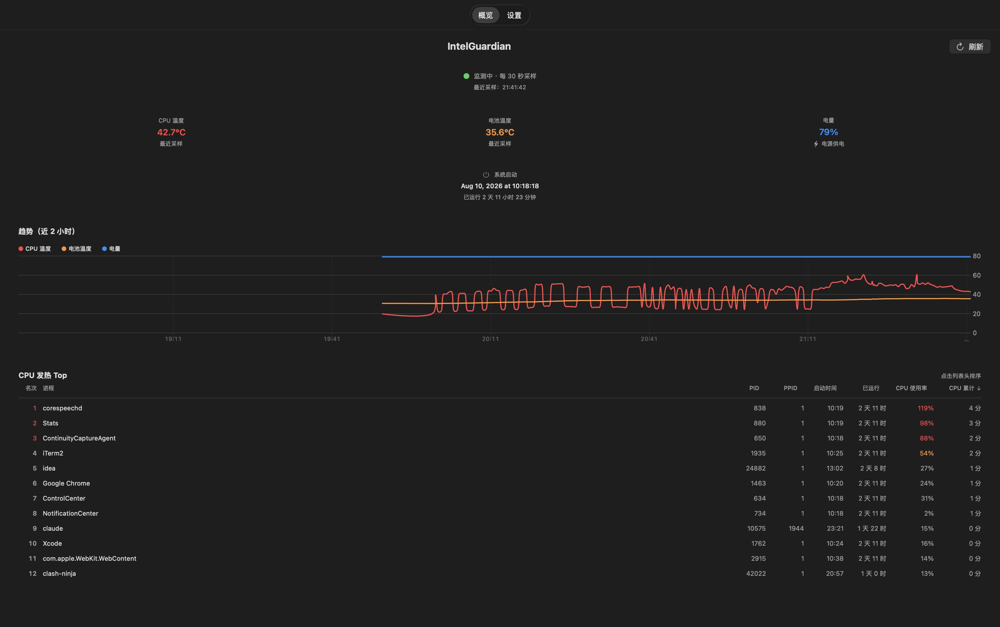
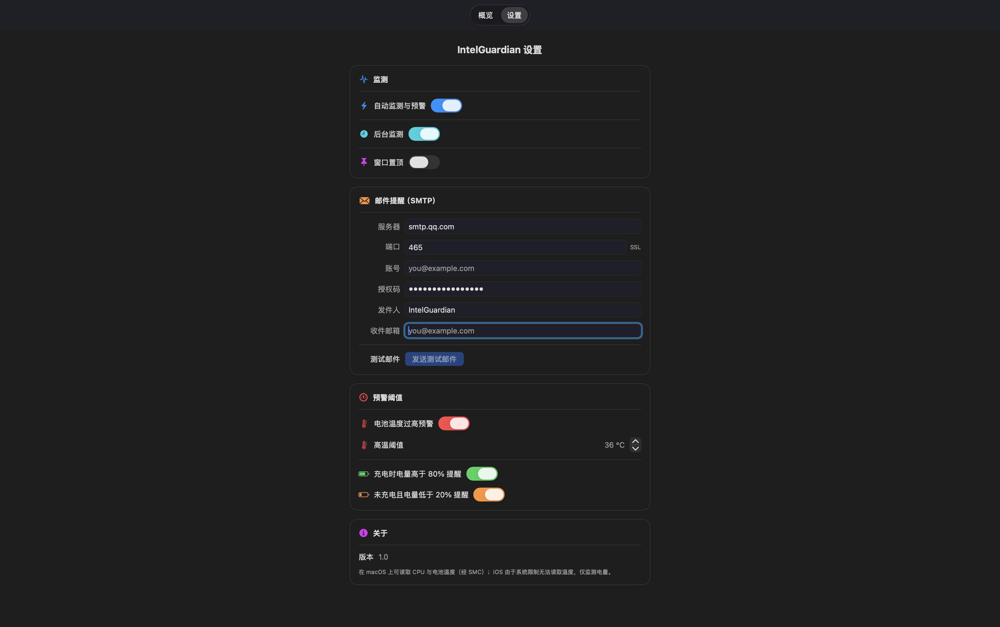

# IntelGuardian

**IntelGuardian** is a lightweight, cross-platform system health monitor for **macOS** and **iOS**. It watches your device's thermal and battery state in real time and sends **email alerts** the moment something looks wrong — so you can act before heat or a drained battery becomes a problem.


---

## Screenshots

macOS dashboard — real-time CPU & battery temperature, charge level, and a 2-hour trend chart.



macOS settings — SMTP email alerts, thresholds, and monitoring toggles.



---

## Table of Contents

- [Why IntelGuardian](#why-intelguardian)
- [Business Value](#business-value)
- [Unique Value](#unique-value)
- [Tech Architecture](#tech-architecture)
- [Project Structure](#project-structure)
- [How to Run](#how-to-run)
  - [Prerequisites](#prerequisites)
  - [3-Way Build & Run Script](#3-way-build--run-script)
  - [Manual Build (Xcode)](#manual-build-xcode)
- [Email Alerts Configuration](#email-alerts-configuration)
- [Platform Feature Matrix](#platform-feature-matrix)
- [Compatibility Notes](#compatibility-notes)

---

## Why IntelGuardian

Smartphones and laptops are getting faster — and hotter. Sustained CPU or battery heat degrades hardware and shortens battery life. Most people don't notice until their device throttles, shuts down, or the battery swells.

IntelGuardian closes that blind spot:

- **Continuous monitoring** — samples every 30 seconds, keeps 7 days of history.
- **Proactive alerting** — emails you the instant a threshold is crossed, with a trend chart attached.
- **Dual-platform** — one codebase, native behavior on macOS and iOS.

## Business Value

- **Hardware protection** — early-warning on overheating reduces warranty claims and device replacement costs.
- **Fleet visibility** — the email subject line includes device type, OS version, and username, so a single glance tells you *which machine* and *which metric* needs attention.
- **Operational cost** — no backend needed. SMTP credentials are stored in the Keychain; alert emails are sent directly over Network.framework. Zero infrastructure to run.

## Unique Value

- **Real CPU / battery temperatures on macOS** — reads the System Management Controller (SMC) via IOKit and the AppleSmartBattery IORegistry node, averaging multiple sensors (Apple Silicon `Tp*/Te*/Th*` and Intel `TC*` keys).
- **Email with inline charts** — every alert embeds a PNG + interactive SVG trend chart, so the recipient sees the whole picture without opening an attachment.
- **Battery-aware charge alerts** — reminds you to stop charging at 80% and to charge at 20%, protecting long-term battery health.
- **Truly offline** — works fully offline except for the SMTP send. No analytics, no cloud, no account required.

## Tech Architecture

```
┌─────────────────────────────────────────────────────────────┐
│                        SwiftUI (Views)                       │
│   DashboardView · SettingsView · DualLineChart/TripleChart  │
└───────────────────────────┬─────────────────────────────────┘
                            │ @ObservedObject / @EnvironmentObject
┌───────────────────────────▼─────────────────────────────────┐
│                    MonitorService (ViewModel)                │
│   • 30s sampling timer        • alert evaluation + cooldown  │
│   • 5s battery fast-polling   • Swift Charts + JSON store    │
└──────┬──────────────────────────────┬────────────────────────┘
       │ SystemInfo.current()         │ store.insert(sample)
┌──────▼──────────┐          ┌────────▼──────────┐
│ SystemInfo      │          │ SampleStore       │
│ (aggregator)    │          │ • Codable structs │
└──────┬──────────┘          │ • JSON file       │
       │                      └────────┬──────────┘
┌──────▼──────────────────────────────▼──────────┐
│                Platform Services                │
│   SMCReader (macOS)  BatteryReader  Keychain   │
└──────┬─────────────────────────────────────────┘
       │
┌──────▼──────────────────────────────────────────┐
│                EmailService / SMTPClient          │
│   MIME builder + inline SVG/PNG charts → SMTP    │
└──────────────────────────────────────────────────┘
```

**Key decisions**

| Concern | Choice | Why |
|---------|--------|-----|
| Data model | `Codable` struct + JSON file | No SwiftData (iOS 17+ / macOS 14+ only); supports our iOS 15 / macOS 12 minimums |
| State management | Combine `ObservableObject` + `@Published` | The `@Observable` macro needs iOS 17+; Combine works on iOS 13+ |
| Charts (in-app) | Swift Charts | Declarative, interactive; gated behind `@available(iOS 16/macOS 13)` with a text fallback |
| Charts (email) | CoreGraphics PNG + hand-built SVG | Gmail strips SVG, so every alert also carries a deterministic PNG |
| Networking | Network.framework (`NWConnection`) | Same code runs on iOS and macOS; implicit TLS on port 465 |
| Secrets | Keychain | SMTP password never touches UserDefaults or disk in plaintext |
| Navigation | `NavigationStack` with `NavigationView` fallback | Covers iOS 15 / macOS 12 where the stack API is unavailable |

## Project Structure

```
IntelGuardian/
├── IntelGuardian/
│   ├── IntelGuardianApp.swift      # App entry, injects settings + monitor
│   ├── Models/
│   │   ├── SystemInfo.swift        # Aggregates current readings (Sendable)
│   │   └── ThermalSample.swift     # Codable sample + SampleStore (JSON persistence)
│   ├── Services/
│   │   ├── AppSettings.swift       # ObservableObject, didSet auto-persists
│   │   ├── BatteryReader.swift     # Battery level / temp / charging (iOS+macOS)
│   │   ├── SMCReader.swift         # macOS SMC temperature reading (IOKit)
│   │   ├── EmailService.swift      # MIME build + SVG/PNG charts
│   │   ├── EmailChartRenderer.swift# CoreGraphics PNG renderer
│   │   ├── KeychainStore.swift     # Keychain wrapper for SMTP password
│   │   └── SMTPClient.swift        # Minimal SMTP over Network.framework
│   ├── ViewModels/
│   │   └── MonitorService.swift    # Sampling timer, alerts, battery polling
│   └── Views/
│       ├── ContentView.swift       # Tab shell (modern/legacy navigation)
│       ├── DashboardView.swift     # Metrics grid + trend charts
│       ├── SettingsView.swift      # SMTP + threshold configuration
│       └── InteractiveLineChart.swift  # DualLineChart / TripleLineChart
├── IntelGuardianTests/             # Unit tests
├── IntelGuardianUITests/           # UI tests
├── doc/sh/build_and_run.sh         # 3-way build & run script
└── COMPATIBILITY_REPORT.md         # iOS 15 / macOS 12 compatibility audit
```

## How to Run

### Prerequisites

- **macOS 12+** (build machine)
- **Xcode 15+** (Xcode 26 recommended)
- A **free or paid Apple Developer team** (signing for device installs)

### 3-Way Build & Run Script

The fastest way to build the latest code and run it on **all three targets at once**:

```bash
./doc/sh/build_and_run.sh          # Debug, all 3 targets
./doc/sh/build_and_run.sh --release
```

What it does:

| Target          | Build | Launch |
|-----------------|-------|--------|
| macOS           | `.build/macos`            | `open` the app |
| iOS Simulator   | `.build/ios-simulator`    | `simctl install` + `launch` |
| iOS Device      | `.build/ios-device`       | `devicectl install` + `launch` (wireless) |

> **Note on device signing**: the first install may fail with `Security / RequestDenied`.
> Trust the developer certificate on the device:
> **Settings → General → VPN & Device Management**, or run once from Xcode.

### Manual Build (Xcode)

1. Open `IntelGuardian.xcodeproj`.
2. Select the `IntelGuardian` scheme.
3. Pick a destination (My Mac / iPhone simulator / your device).
4. Press **⌘R**.

## Email Alerts Configuration

1. Open the **Settings** tab.
2. Fill in the SMTP fields (server, port 465, account, authorization code, recipient).
3. Press **发送测试邮件** (Send test email) to verify.
4. Tune the alert thresholds (temperature / thermal state / 80% / 20%).

Supported providers include Gmail, QQ Mail, 163, and Outlook (any SMTP with implicit TLS on port 465).

## Platform Feature Matrix

| Feature | macOS | iOS |
|---------|-------|-----|
| CPU temperature | ✅ (SMC) | — (no public API) |
| Battery temperature | ✅ (IORegistry/SMC) | — (no public API) |
| Battery level | ✅ | ✅ |
| Charging status | ✅ | ✅ |
| Thermal state | — | ✅ (`ProcessInfo`) |
| Trend charts | Combined: CPU + battery temp + level | Combined: thermal state + level |
| Email alerts | ✅ | ✅ |

## Compatibility Notes

Minimum deployment targets are **iOS 15.0** and **macOS 12.0**. The codebase deliberately avoids SwiftData / `@Observable` / `NavigationStack` as hard requirements — it degrades gracefully (text chart summaries, `NavigationView`) on older systems. See [COMPATIBILITY_REPORT.md](COMPATIBILITY_REPORT.md) for the full audit.

---

Built with SwiftUI, Swift Charts, Combine, and Network.framework.
